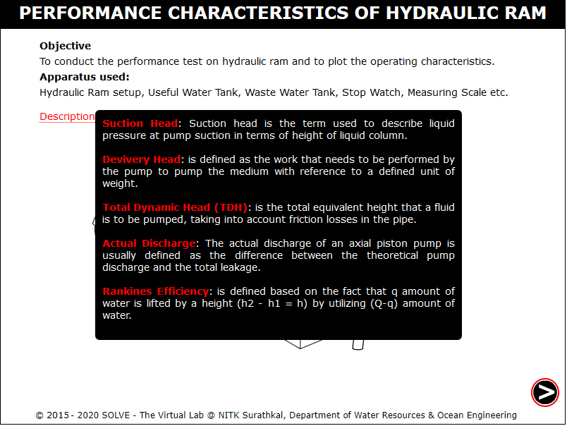
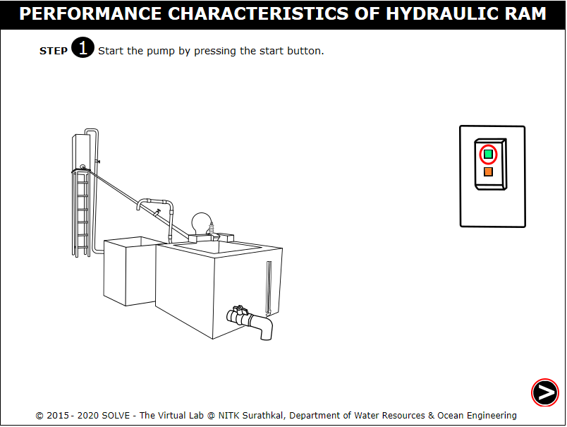
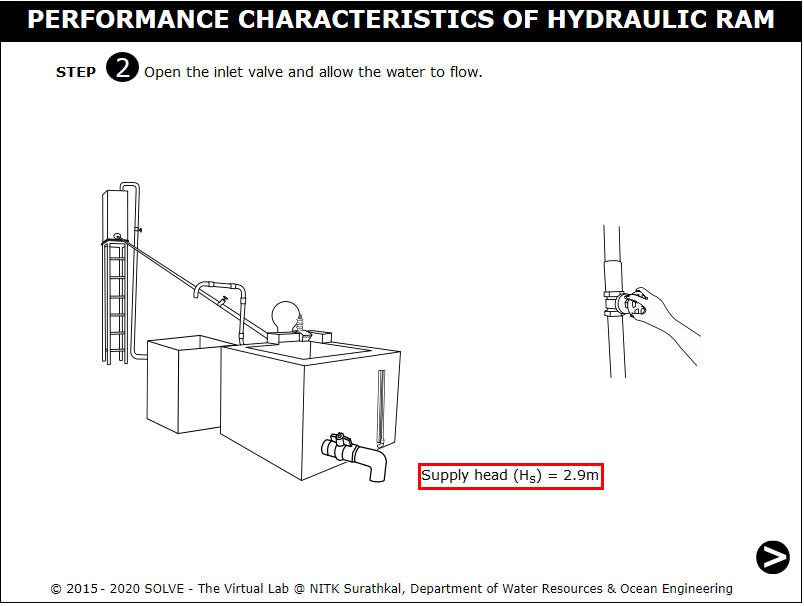
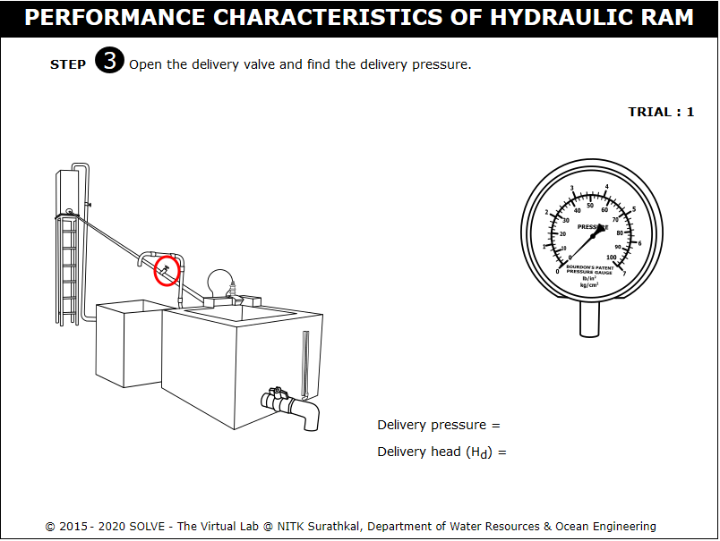
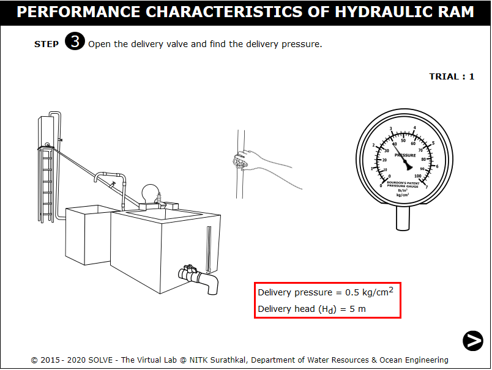
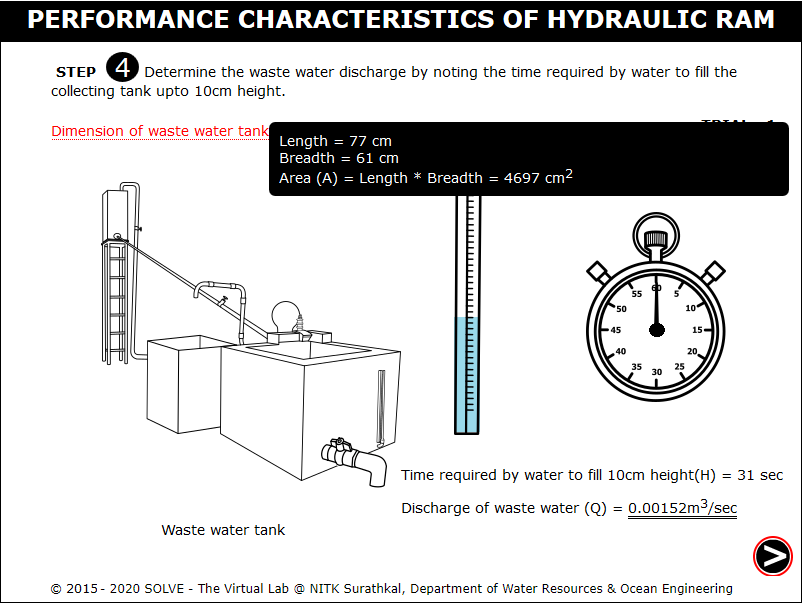
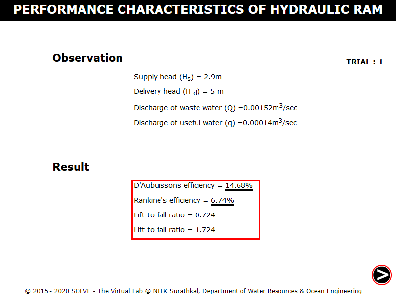
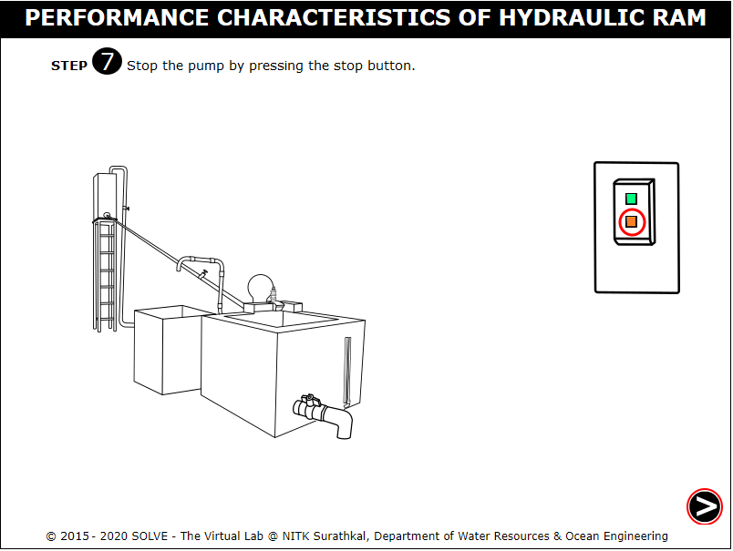
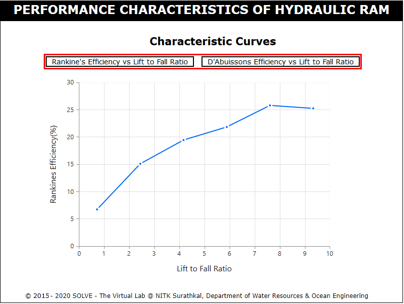

#### These procedure steps will be followed on the simulator

1. Open the Hydraulic Ram experiment and click on the arrow mark shown at the bottom right corner. 
 

2. Click on the green button to start the pump and click on NEXT button. 
 

3. Click on inlet valve and click on hand to rotate the inlet valve. 
 

4. Note the supply head reading and click on the NEXT button as shown in circle. 
 

5. Click on delivery valve and click on the hand to open the delivery valve. 
 

6. Note the delivery head of water and click on NEXT button. 
 

7. Note the time and calculate the discharge in the waste water tank which is collected upto 10cm height over a period of time. Click on NEXT button. 
 

8. Note the time and calculate the discharge in the useful water tank which is collected upto 10cm height over a period of time. Click on NEXT button. 
 

9. Note the results of first trial and click on NEXT button. 
 

10. Repeat the same procedure, after certain trials, click on the red button to stop the pump and click on the NEXT button to see the characteristic graphs. 
 

11. Click on each label button to see the different characteristic graph. 
 
