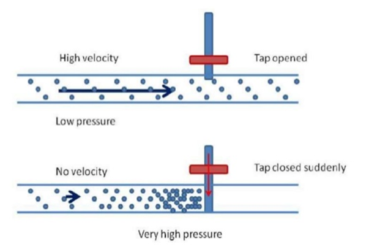
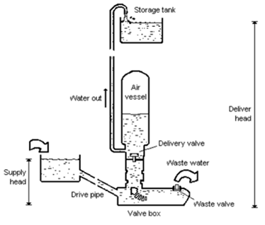
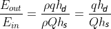
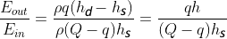

### INTRODUCTION 

Everything on earth requires energy to carry out work. Various technologies are used to transform one source of energy to another like chemical energy of the fuel into mechanical energy, electricity to transform electrical energy into potential energy of the lifted water. There are two types of energy conversion system:

<ol style="text-indent:25px;text-align:justify;list-style-position: inside;">
<li><strong>Hydrostatic system</strong>: In this system transmission is due to hydraulic pressure. The main elements are,
<ol style="text-indent:50px;text-align:justify;list-style-position: inside;list-style-type: loweralpha">
<li><strong>Pumping unit</strong>: That act as a power source to develop the hydraulic pressure from mechanical work, usually it is a rotary or a reciprocating pump.</li>

<li><strong>Transmission line</strong>: Through the transmission line power and energy are transmitted from the place of production to the place of its necessity.</li>

<li><strong>Hydraulic motor</strong>: This reconverts the hydraulic pressure into mechanical work. Again this can be of rotary or reciprocating type in the form of cylinder and piston. Piston in the cylinder is moved by the fluid pressure providing useful work. E.g. Hydraulic press, lift, crane etc.</li>
</ol>
</li> 
<li><strong>Hydro Kinematics system</strong>: In this transmission is due to change in the velocity and the direction of fluid flow. With negligible change in the pressure of the fluid it has two main elements.
<ol style="text-indent:50px;text-align:justify;list-style-position: inside;list-style-type: loweralpha">
<li><strong>Pump</strong>: Impeller driven by the driving shaft.</li>

<li><strong>Turbine Runner to run the driven shaft</strong>: There is circulation of oil from the pump impeller to the runner that transmits power. e.g. Hydraulic Ram.</li>
</ol>
</li>
</ol> 

The hydraulic Ram pump or hydram is a complete automatic device that uses the energy in the flowing water such as spring, stream or river to pump part of the water to a height above that of the source. With a continuous flow of water a hydram operates continuously with no external energy source. It works on the principle of water hammer effect in inertia force of water in a pipe line. When a flowing fluid is brought to rest suddenly a rise of pressure occurs. This can be utilized to raise a portion of water to a higher level. It does not require any external power for its operation. It consists of a two moving parts waste valve and delivery valve, both being none return valves. The delivery pipe is connected to an air vessel to carry the air compressed. A delivery pipe connects the available water source to the valve chamber.

At particular moment assume that the delivery valve is closed and the waste valve open. Water flows down the supply pipe into the valve chamber and then through the waste valves into waste water tunnel. As the velocity of water in the pipe increases, the dynamic pressure on the underside of the waste valve becomes high. This closes the waste valve which was open due to its own weight. With the sudden closure of the waste valve the velocity reduces to zero and the pressure in the valve chamber increases. The higher pressure of water forcibly opens the delivery. A pressure vessel containing air cushions the hydraulic pressure shock when the waste valve closes, it improves the pumping efficiency by allowing more constant flow thorough the delivery pipe.

<h4 style="text-indent:50px;text-align:justify">Working principle:</h4>

Ram pump have a cyclic pumping action that produces their characteristic beat during operation. The cycle can be divided into three phases; acceleration, delivery, and recoil.

<h4 style="text-indent:50px;text-align:justify">Acceleration:</h4>

When the waste valve is open the water accelerates down the drive pipe and discharges through the waste valve. As the flow increases it reaches a speed where the drag force is sufficient to start closing the valve. Once it has begun to move the valve closes very quickly.

<h4 style="text-indent:50px;text-align:justify">Delivery:</h4>

As the waste water valve slams shut it stops the flow of water through it. The water that has been flowing in the drive pipe has considerable momentum which has to be dissipated. For a fraction of second, the water in the body of the pump is compressed causing a large surge in pressure. This type of pressure rise is known as water hammer. As the pressure rises higher than that in the air chamber it forces water through the delivery valve. The delivery valve stays open until the water in the drive pipe has almost completely slowed and the pressure in the pump body drops below the delivery pressure. The delivery valve then closes, stopping any back flow from the air vessel into the pump and drive pipe.

<h4 style="text-indent:50px;text-align:justify">Recoil:</h4>

The remaining flow in the drive pipe recoils against the closed delivery valve. This causes the pressure in the body of the pump to drop low enough for the waste valve to reopen. The recoil also sucks a small amount of air in through the snifter valve. The air sits under the delivery valve until the next cycle when it is pumped with the delivery water into the air vessel. This ensures that the air vessel stays full of air. When the recoil energy is finished, water begins to accelerate down the pipe and out through the open waste valve, starting the cycle again. Throughout the cycle the pressure in the air vessel steadily forces water up the delivery pipe. The air vessel smoothes the pulsing in flow through the delivery valve into an even outflow up the delivery pipe. The pumping cycle happens very quickly typically 40 to 120 times per minute.

  

Water Hammer Effect

Source: <a href="https://www.slideshare.net/niravdon/full-report-of-hydraulic-ramp-pump-53604068">https://www.slideshare.net/niravdon/full-report-of-hydraulic-ramp-pump-53604068</a>

<h4 style="text-indent:50px;text-align:justify">Components of Hydraulic Ram</h4>

A hydraulic ram consists of a supply, a drive pipe, waste valve, delivery valve, snifter valve, valve chamber, ram, a supply line and a storage tank.

<strong>Supply</strong>: The intake supply line is designed to keep trash and sand out of the supply since these can plug up the ram. If the water is not naturally free of these materials, the intake should be screened by placing suitable screening device. When the source is remote from the ram site, the supply line can be designed to conduct the water to a drive pipe. If needed the supply line should be at least one pipe diameter larger than the drive pipe.

<strong>Drive pipe</strong>: For maximum efficiency the drive pipe must be of a non-flexible material. Generally the drive pipe will be of galvanized iron pipe, although other materials cased in concrete will work. In order to reduce head loss due to friction, the length to diameter ratio of the pipe should be within the range of 150-1,000.

<strong>Snifter valve</strong>: It is a device to allow the air to enter the air vessel located above delivery valve but below delivery pipe. It is very important for air to enter because air in the air vessel mixes with water while hydram is running. As a result the volume of the air in the air vessel decreases and this will bring about the reduction in pump efficiency, thus it is important to have snifter valve. In short the snifter valve enables the maintenance of a necessary air level inside the air vessel.

<strong>Ram</strong>: Rams will be constructed using commercially available check valves or by fabricating check valves securely attached to an immovable base, preferably concrete. Rams can be used in tandem to pump water if one ram is not large enough to supply the need. Each ram must have its own drive pipe, but all can pump through a common delivery pipe securely attached to an immovable base, preferably concrete, and that the waste-water is drained away.  The pump can-not operate when submerged.

  

Cross-section of Hydraulic Ram
 

Source: (<a href="https://www.brighthubengineering.com/hydraulics-civil-engineering/44729-learn-about-hydraulic-ram-pumps">https://www.brighthubengineering.com/hydraulics-civil-engineering/44729-learn-about-hydraulic-ram-pumps</a>)

 

Let Q be the discharge from the supply tank to the valve box and q be the discharge from the valve box to delivery tank. Also let hs and hd be the head of water in the supply tank and delivery tank respectively above valve box.

Then the energy supplied by the supply tank is

  

 

The energy delivered by the ram is

  

 

The efficiency of the ram may be written as

 = 

 

The efficiency is known as D'Aubuisson's efficiency. Another efficiency called Rankine's efficiency was defined based on the fact that

amount of water is lifted by a height  by utilizing
()
amount of water.
 

Accordingly the Rankine's efficiency is,

 = 

These hydraulic ram can be used for water supply to country side and remote areas where a source having large quantity of water at a smaller heights is available.

